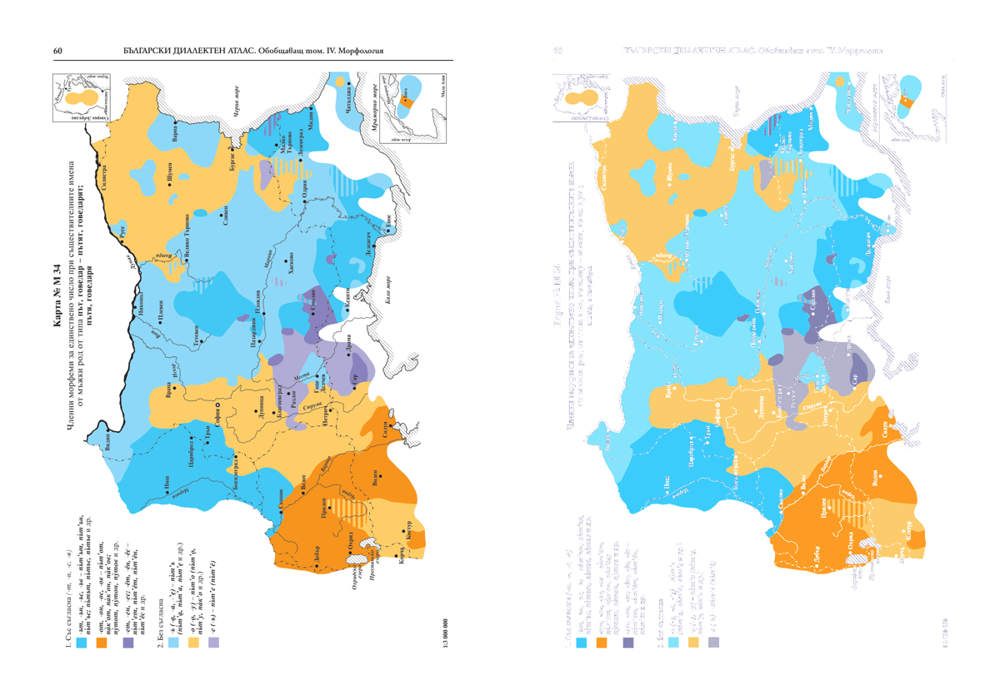
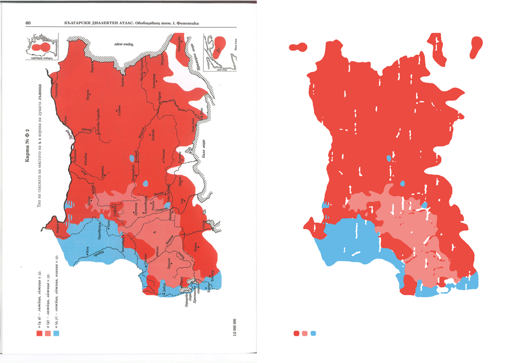

# Проучване: източници на данни и извличане от Българския диалектен атлас (БДА)

Дата: 2026-09-27

## 1. Какво има онлайн

Електронната библиотека „Българско езикознание“ на ИБЕ–БАН (`ibl.bas.bg/lib/`) показва сканирани книги
чрез **Internet Archive BookReader** (JavaScript визуализатор на книги, отворен код).

- `bookId=bda`: *БДА. Обобщаващ том I–III: Фонетика, Акцентология, Лексика* (Труд, 2001).
- `bookId=bda4`: *БДА. Обобщаващ том IV: Морфология* (АИ „Проф. Марин Дринов“, 2016):
  145 цветни карти, коментари и показалци, данни от над 2300 селища.

> Проверено: вижте раздел 5 за URL адресите, резолюцията и пробата.

## 2. Техническа възможност за извличане

**Да, извличането е възможно, но полуавтоматично.** Атласът съдържа изображения на карти, не данни.
Може да се реконструира таблица „селище × признак“, но с ръчна работа по легендите и с проверка.

### Предложен процес

1. **Сваляне на страниците.** BookReader зарежда всяка страница като отделно изображение по предвидим
   URL шаблон, който се задава в JS конфигурацията на страницата. С малък скрипт се свалят всички
   страници в най-високата налична резолюция. Трябва да се отвори една страница в браузър
   (DevTools → Network), за да се види шаблонът.
2. **Георефериране.** Всички карти в тома са отпечатани върху една и съща основа. Затова е достатъчно:
   - основата да се георефенцира веднъж с контролни точки (градове, граници, реки) в QGIS/GDAL;
   - всяка следваща страница да се подравни автоматично към еталонната (OpenCV: ORB/ECC регистрация),
     така че една и съща трансформация да важи за всички страници.
3. **Мрежа от пунктове.** Встъпителната част и показалците съдържат списъка на населените места
   с номерата им. Той се геокодира:
   - в България: чрез ЕКАТТЕ / [yurukov/Bulgaria-geocoding](https://github.com/yurukov/Bulgaria-geocoding);
   - извън България (Северна Македония, Гърция, Сърбия, Румъния, Молдова, Украйна и др.): чрез GeoNames,
     с ръчна проверка на старите имена.
4. **Извличане на признаците.** Две възможни стратегии:
   - **Вземане на проби по точки (препоръчително):** за всяко селище се прочита цветът или
     щриховката на картата в неговите координати. Резултатът е матрица „пункт × признак“,
     удобна за уеб карта и за диалектометрия.
   - **Векторизиране на ареалите:** цветовете се квантуват до цветовете от легендата, после
     маските се превръщат в полигони (`rasterio.features.shapes`, опростяване). Щриховките,
     наслагванията и символите изискват морфологична обработка или ръчна корекция.
5. **Легенди и коментари.** OCR (Tesseract `bul`) или модел за разпознаване на изображения,
   после ръчна редакция. Всяка карта получава метаданни: номер, тема, варианти и тяхното кодиране.
6. **Проверка.** Ръчна проверка на извадка от пунктове за всяка карта.

### Рискове

- **Резолюция на сканираните страници:** ако е ниска, номерата на пунктовете не се четат,
  но цветните ареали се различават.
- **Сложна картография:** припокриващи се ареали, щриховки и единични символи.
- **Авторски права и права върху бази данни:** БДА е публикуван 2001 и 2016 г. и е с активни
  авторски права (БАН/ИБЕ). В ЕС освен това има sui generis право върху бази данни, което покрива
  извличането на съществена част. За публичен проект трябва да се поиска разрешение от ИБЕ.

## 3. Алтернативни и допълващи източници

| Източник | Какво съдържа | Полезност |
|---|---|---|
| **Архивът на БДА и Секцията по диалектология и лингвистична география на ИБЕ** | Първичните материали и вероятно изходните файлове на картите от 2001 и 2016 г. | **Най-адекватният източник.** Струва си да се поискат данните или векторните оригинали, вместо да се реконструират от сканове. |
| [Карта на диалектната делитба (ИБЕ)](https://ibl.bas.bg/bulgarian_dialects/) | Интерактивна карта с основните диалекти (60+ области) и аудиозаписи. | Готова класификация на областите; подходяща за първа версия. Трябва да се провери дали отдолу има GeoJSON. |
| „Buldialect“ (Houtzagers, Nerbonne, Prokić; [Serdica J. Computing 2009](https://serdica-comp.math.bas.bg/index.php/serdicajcomputing/article/download/sjc.2009.3.269-298/pdf/149)) | Фонетични транскрипции на 157 думи от 197 села (от дипломните работи в архива на СУ), 39 признака. | Истински цифрови данни за диалектометрия. Не намерих публикация за изтегляне; трябва да се пише на авторите. |
| [Bulgarian Dialectology as Living Tradition](https://bulgariandialectology.org/) (Berkeley; Alexander, Zhobov) | Корпус на устна реч от десетки села с търсене по диалектни признаци. | Добре анотирани текстове и примери. Позволено е само некомерсиално цитиране, без изтегляне на голяма част. |
| [ОЛА](https://slavatlas.org/) и [българските материали на ИБЕ](https://ibl.bas.bg/en/obshtoslavyanski-lingvistitchen-atlas-ola-2/) | Общославянски атлас, около 850 пункта общо, от които малко са български. | Твърде рядка мрежа; полезен само за сравнение със съседните езици. |
| [Кулинарна карта (ИБЕ)](https://kulinar.ibl.bas.bg/) | Лексикална карта за кулинарната лексика. | Тесен тематичен обхват. |
| [Wikimedia Commons: Linguistic maps of Bulgaria](https://commons.wikimedia.org/wiki/Category:Linguistic_maps_of_Bulgaria) | Карти на диалектната делитба по Стойков (растерни изображения). | С отворен лиценз; удобни за бърза векторизация на основните области. |
| Регионалните томове на БДА (1964–1981, ред. Ст. Стойков), 4 тома + том за Цариброд и Босилеград (1986) | Точкови карти (символ за всеки пункт). | Точковите карти са по-лесни за автоматично извличане от ареалните, но трябва да се намерят сканове. |

## 4. Препоръка

1. **Първа версия (дни):** карта на диалектната делитба: векторизирани области по класификацията
   на ИБЕ/Стойков. Не зависи от извличането на БДА.
2. **Паралелно:** писмо до Секцията по диалектология на ИБЕ с молба за данните или изходните файлове
   на картите и за разрешение за използване. Това може да спести седмици реконструкция.
3. **Пилотно извличане:** 5–10 карти от том IV (Морфология) по процеса от раздел 2, за да се оцени
   реално качеството и нужният ръчен труд, преди да се мащабира.

## 5. Пилотна проверка на живите данни (2026-09-27)

### Как се зареждат страниците

- Манифест на книгата (JSON): `https://ibl.bas.bg/lib/index.php?action=metadata&bookId={bda|bda4}`,
  в `data.brOptions.data` е списъкът на страниците.
- Страница (PNG): `https://ibl.bas.bg/lib/index.php?bookId={bookId}&action=page&page={NNNN}`,
  номерирани от `0001`.
- `bda`: том I–III (Фонетика, Акцентология, Лексика), Труд 2001, **538 страници**.
- `bda4`: том IV (Морфология), БАН 2016, **248 страници**.
- **Реална резолюция: 1200 × ~1700 px (150 dpi)**. Параметрите `scale` и други не дават по-голяма
  резолюция; стойностите в манифеста (2004×3122, 400 ppi) не отговарят на реалните файлове.
- **Няма текстов слой** (djvu_xml връща 404). Коментарите и съдържанието изискват OCR.

### Какво има на картите

- Картите са **ареални**: цветни области с легенда, 1:3 000 000, завъртени на 90° върху страницата.
  Няма номерирани пунктове, затова ниската резолюция не пречи.
- Всички карти са върху **една и съща основа**: граници, реки, ~50 града с точки и имена.
  Георефериране с контролни точки по градовете е лесно.
- Обхватът е цялата българска езикова територия: България, Македония, Егейска Македония, Тракия,
  Северна Добруджа (вложка) и Мала Азия (вложка).
- Съдържанието (стр. 5 и следващите) изброява картите с номер, тема и страница (напр. „Карта № А 29 …
  313“). Това е готов индекс за метаданните след OCR.

### Проба за сегментация по цвят

| | Том IV (М 34, стр. 60) | Том I (Ф 2, стр. 60) |
|---|---|---|
| Печат | Дигитален, чисти плътни цветове | Сканиран офсетов печат с растер |
| Резултат | 6 цвята покриват ~96% от оцветените пиксели, 1:1 с легендата | 3 класа след медианен филтър |
| Проблеми | Щриховки (райета) за смесени зони | Щриховките се губят; дупки от надписите |

**Извод:** извличането е реалистично. Том IV е почти автоматичен. Том I–III иска
филтриране и калибриране на цветовете за всяка карта. Щриховките (две форми в една зона)
изискват отделен детектор или ръчна корекция. Легендите трябва да се транскрибират,
полуавтоматично с OCR и ръчна проверка.

## Отворени въпроси

- Съдържат ли томовете встъпителната част със списъка на пунктовете?
  Не е задължително, тъй като картите са ареални.
- Как точно да се кодират щриховките: като „и двете форми“ или като отделен клас?
